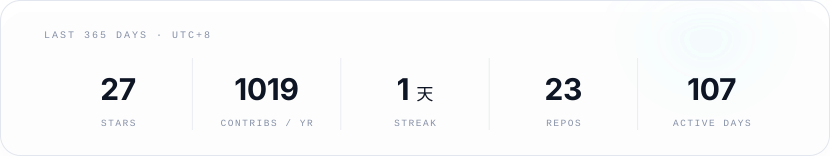
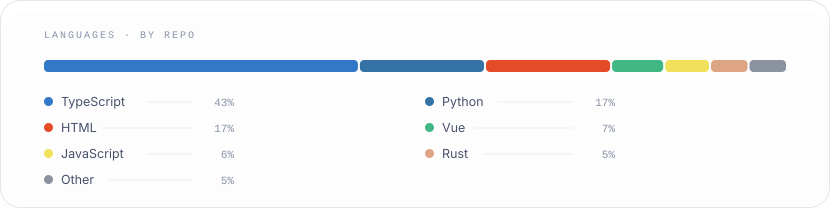
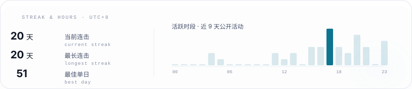
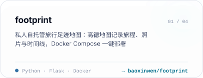
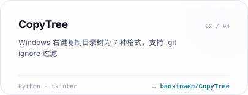
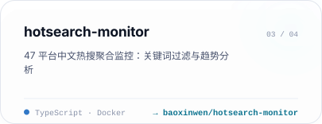
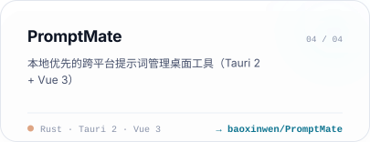
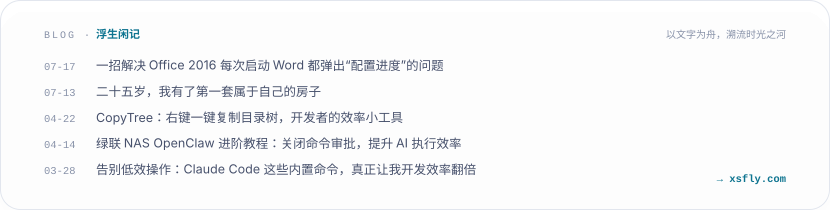

  <a href="https://xsfly.com">
    <picture>
      <source media="(prefers-color-scheme: dark)" srcset="assets/generated/hero.dark.svg" />
      
    </picture>
  </a>

<picture>
  <source media="(prefers-color-scheme: dark)" srcset="assets/generated/hd-about.dark.svg" />
  
</picture>

- 🔭 正在折腾：给自己用的自托管小工具——旅行足迹地图、目录树复制、热搜监控
- 🌱 在学：Rust（下一批工具的语言）
- 📫 找到我：GitHub Issue / Discussion · 博客 [浮生闲记](https://xsfly.com)

<picture>
  <source media="(prefers-color-scheme: dark)" srcset="assets/generated/hd-stack.dark.svg" />
  
</picture>

  <picture>
    <source media="(prefers-color-scheme: dark)" srcset="https://skillicons.dev/icons?i=typescript,nodejs,python,rust,docker,git,linux,postgres,redis&theme=dark" />
    
  </picture>

<picture>
  <source media="(prefers-color-scheme: dark)" srcset="assets/generated/hd-data.dark.svg" />
  
</picture>

<picture>
  <source media="(prefers-color-scheme: dark)" srcset="assets/generated/stats.dark.svg" />
  
</picture>

<picture>
  <source media="(prefers-color-scheme: dark)" srcset="assets/generated/langs.dark.svg" />
  
</picture>

<picture>
  <source media="(prefers-color-scheme: dark)" srcset="assets/generated/streak.dark.svg" />
  
</picture>

<picture>
  <source media="(prefers-color-scheme: dark)" srcset="assets/generated/hd-projects.dark.svg" />
  
</picture>

  <a href="https://github.com/baoxinwen/footprint">
    <picture>
      <source media="(prefers-color-scheme: dark)" srcset="assets/generated/project-1.dark.svg" />
      
    </picture>
  </a>
  <a href="https://github.com/baoxinwen/CopyTree">
    <picture>
      <source media="(prefers-color-scheme: dark)" srcset="assets/generated/project-2.dark.svg" />
      
    </picture>
  </a>

  <a href="https://github.com/baoxinwen/hotsearch-monitor">
    <picture>
      <source media="(prefers-color-scheme: dark)" srcset="assets/generated/project-3.dark.svg" />
      
    </picture>
  </a>
  <a href="https://github.com/baoxinwen/PromptMate">
    <picture>
      <source media="(prefers-color-scheme: dark)" srcset="assets/generated/project-4.dark.svg" />
      
    </picture>
  </a>

  <picture>
    <source media="(prefers-color-scheme: dark)" srcset="https://raw.githubusercontent.com/baoxinwen/baoxinwen/output/snake-dark.svg" />
    
  </picture>

<picture>
  <source media="(prefers-color-scheme: dark)" srcset="assets/generated/hd-blog.dark.svg" />
  
</picture>

  <a href="https://xsfly.com">
    <picture>
      <source media="(prefers-color-scheme: dark)" srcset="assets/generated/blog.dark.svg" />
      
    </picture>
  </a>

<picture>
  <source media="(prefers-color-scheme: dark)" srcset="assets/generated/footer.dark.svg" />
  
</picture>

  

